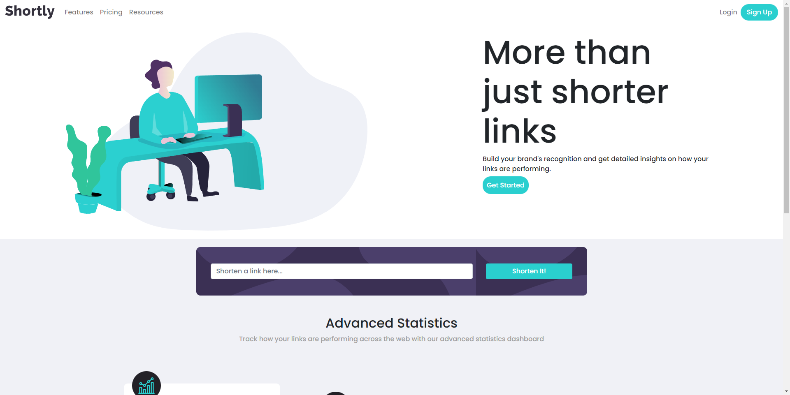

# Frontend Mentor - Shortly URL Shortening API Challenge solution

This is a solution to the [Shortly URL shorting API Challenge on Frontend Mentor](https://www.frontendmentor.io/challenges/url-shortening-api-landing-page-2ce3ob-G). Frontend Mentor challenges help you improve your coding skills by building realistic projects.

## Table of contents

- [Overview](#overview)
  - [The challenge](#the-challenge)
  - [Screenshot](#screenshot)
  - [Links](#links)
- [My process](#my-process)
  - [Built with](#built-with)
  - [What I learned](#what-i-learned)
  - [Continued development](#continued-development)
  - [Useful resources](#useful-resources)
- [Author](#author)
- [Acknowledgments](#acknowledgments)

## Overview
The task was to build a URL shortener using shrtcode API, where users can enter a valid URL and have it shortened.

### The challenge

Users should be able to:

- View the optimal layout for the site depending on their device's screen size
- Shorten any valid URL
- See a list of their shortened links, even after refreshing the browser
- Copy the shortened link to their clipboard in a single click
- Receive an error message when the `form` is submitted if:
  - The `input` field is empty

### Screenshot

### Links

- Solution URL: [My solution](https://www.frontendmentor.io/solutions/url-shortener-api-challenge-1zKZy6IBYT)
- Live Site URL: [Goldac77 - URL Shortener](https://goldac77.github.io/URL-Shortener/)

## My process
My approach to this challenge was first tinker with the shrtcode API and learn how to properly fetch data from it and how to make use of said data. I then went ahead to work on the functionality of the page(how to make the request and display the shortened links), before I worked on the design based on the design files
### Built with

- Semantic HTML5 markup
- Flexbox
- Bootstrap
- Mobile-first workflow

### What I learned

The major thing I learnt from this project is how to make use of the clipboard API, and how to fetch and make use of API requests.

### Continued development

I believe I need to work on the knowledge in manipulating dynamically rendered DOM elements, like the ones I used in my #display div

## Author

- Nicholas Amemazior
- Frontend Mentor - [@Goldac77](https://www.frontendmentor.io/profile/Goldac77)